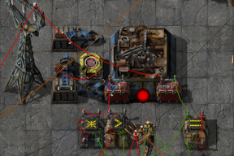

### ConMan - Construction Manager

ConMan allows you to order construction and deconstruction via the circuit network. Limited construction of individual entities can be done directly, and blueprints can be deployed and captured.

  * sub entities:
    * CC Control 1: primary commands - SW corner
    * CC Control 2: secondary data - SE corner
    * Control nodes only read one wire - if both are connected it will only read the red one. Use a combinator to merge wires if required. This is mostly a performance optimization, and is not likely to change.

Position: {X,Y} and {U,V}
BoundingBox: {{X,Y},{U,V}}
Conditions: circuit:C=1, logistics:L=1, op:O={<=>/*-+}, constant:K  {firstsig=1,secondsig=2,output=3} [not implemented yet]

### Commands:

  * conbot + item signal + D=dir + XY : Construction Order
    * optional: B=bar : Number of slots usable in a chest
    * optional: R=recipeid (with recipeid lib)
    * optional: filters or CC data on Control2
    * optional: other entity specific?
  * logbot + items on Control2 + XY : Delivery order
    * Deliver items specified by Control2 to entity at XY
    * Note that these items will be delivered by conbots despite being signalled by logbot.
  * r/g/c wire + XY(Z) + UV(W)
    * connect entities at positions XY and UV with wire, ports Z/W if multiple
    * negative wire to disconnect
  * blueprint=-1 : Eject Blueprint
    * transfer from input to output inventory
  * blueprint=1 + XY : Deploy Blueprint
    * optional: F=force - auto decon trees/rocks in the way
  * blueprint=2 + BoundingBox : Capture Blueprint
    * optional: TEM=what to capture, tiles/entities/modules
    * optional: Control2: signalstring of new blueprint name (with singalstrings lib)
  * blueprint=3: Read Blueprint Info
    * output to Control2: Blueprint label string and color if set
    * output to Control2: Blueprint BoM
  * redprint=1 + BoundingBox : Deconstruction Order
    * redprint=-1 to cancel
    * optional: filters on Control2
      * T = trees
      * R = rocks
      * if empty, decon all!!!

## Test Rig

This is a test rig for manually inputting commands. I use this for developing/testing commands. This requires my mods Location Combinator, Pushbutton, and Nixie Tubes.

The [blueprint](ConMan Test Rig.blueprint) does not include the direct wiring connections to ConMan itself, so you'll have to plug in the following manually after placing:

* Red wire from CC1 to the combinators directly below it
* Red wire from CC2 to the large pole to the left
* Green wire from CC2 to the decider below it

The cursor box shows the XY and UV selections in red and green, respectively. For rectangle selections, XY shoudl be the upper/left, and UV should be lower/right. The cursors are moved by the two D-pads, and can be reset to the upper left using the black button in the center. Cursor selections outside the box are valid, but will not be drawn due to physical limitations of the display.

When placing direction entities, their facing can be selected using the compass below the D-pads. There are buttons to rotate each direction one or two steps, and to reset to North.

When placing chests, the bar (red X to block inserters) can be set using the 'B' selector to the left of the D-Pad.

Onces a position and direction are selected, a construction order can be placed by selecting one of the item buttons (add/reconfigure as required).

Wires can be connected/disconnected(X) by selecting two positions, and pressing the corresponding wire button. the Z/W toggles next to the D-Pads will select the second port of combinators for red/green wire.

For commands which take signals from CC2, there are constant combinators configured for easy toggling (especially with Pushbutton mod - press 'f' to toggle constant combinators!). These can be used to set filters for deconstruction orders, or for entity-specific configuration sa required by construction orders. The name for a captured blueprint can also be provided here, if Signal Strings is also installed. These toggles are also used to set the items for Delivery orders, which can be placed using the LogBot button.

Blueprints may be used to copy large areas directly, but one must be inserted into ConMan first. Blueprints may be:
  * Deployed, using the button with only a blueprint on it. The print will deploy centered on the XY cursor.
  * Force-deployed, using Blueprint+F. The print will be deployed as if shift-clicked.
  * Ejected, using Blueprint+Fast Inserter button. The print will be ejected to the chest beside ConMan. The button directly beside ConMan will reload it.
  * Captured, using Blueprint+C. The print will capture the area selected by the two cursors. If Signal Strings is present, it will also read a name from CC2 for the print.
  * Described, using Blueprint+I. The print name (with Signal Strings) and item needs will be output to the memory cell below CC2.

Deconstruction orders can be placed and cancelled using the Redprint and Redprint+X buttons, and a rectangle selection. If any signals are read on CC2, this will only affect things selected by these signals as filters.
